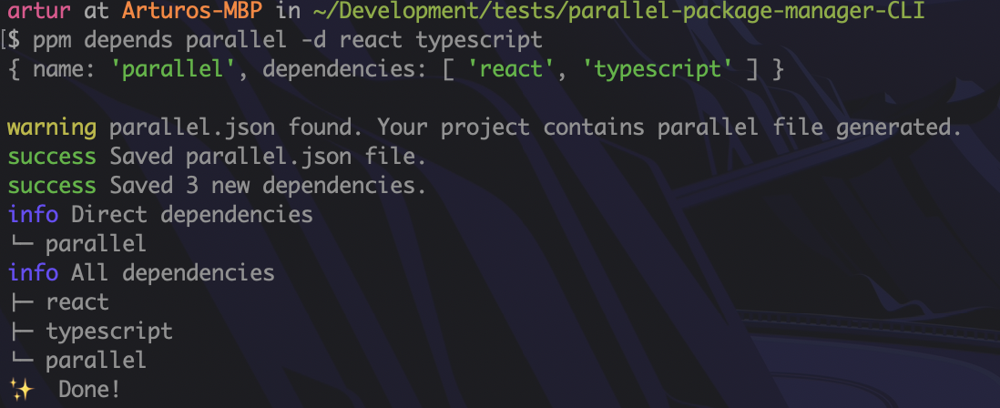
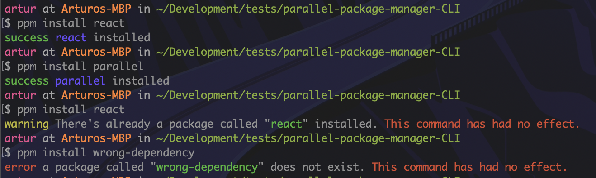
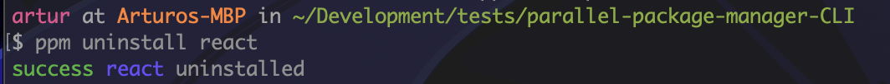
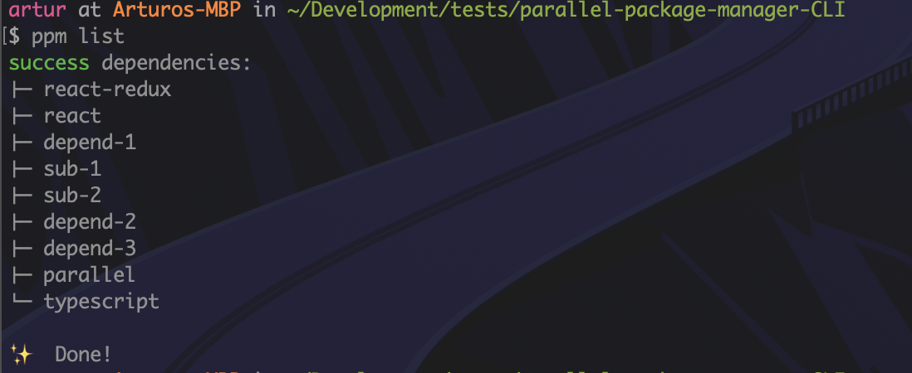
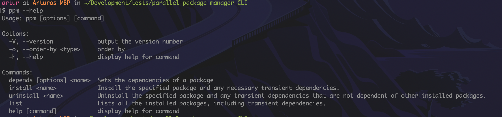

<!-- PROJECT -->
<h2 align="center">Parallel Packages Manager CLI</h2>

<!-- ABOUT THE PROJECT -->
## About The Project

Command line application (CLI) that allows us to use the Parallel packages manager (ppm), this package manager have the following features:

* depends: Sets the dependencies of a package

* install: Installs the specified package and any necessary transient dependencies.

* uninstall: Uninstalls the specified package and any transient dependencies that are not dependent of other installed packages.

* list: Lists all the installed packages, including transient dependencies (the order is not important).

We built the Parallel Package manager Command Line Application with Node.js that can be used on Windows, macOS, or Linux. why node.js? Node.js is a great solution for writing CLI apps. Node.js itself has built-in libraries for reading and writing files, launching other applications, and basic network communication.

### Built With
list of major frameworks and library that was used to build this project.
* [node.js](https://nodejs.org/en/)
* [charlk](https://github.com/chalk/chalk)
* [commander](https://github.com/tj/commander.js)
* [Lowdb](https://github.com/typicode/lowdb)

<!-- GETTING STARTED -->
## Getting Started

To clone and run this application.

### Prerequisites

you'll need [Git](https://git-scm.com) and [Node.js](https://nodejs.org/en/download/) (which comes with [npm](http://npmjs.com) or use [yarn](https://classic.yarnpkg.com/en/docs/install/)) installed on your computer. From your command line:

### Installation

1. Clone this repo
```sh
git clone https://github.com/arturoliduena/parallel-package-manager-cli.git
```

2. Go into the repository
```sh
cd parallel-package-manager-cli
```

3. install package
```sh
yarn
```
or
```sh
npm install
```
4. running parralel packages manager (ppm)

you can run the script just like any other Node.js application. Try entering the following from the command line. you must be in the project folder to use ppm (local).
```sh
node . <command>
```
or
```sh
npm run ppm -- <command>
```
However, if you want to be able to run it from anywhere. You can install ppm global.
```sh
yarn link
```
or
```sh
npm link
```
or
```sh
npm install -g .
```
This installs your script “globally.” Any commands listed in the bin section of the package.json file will be made available as command line applications. You can now run your script by typing ppm at the command line.
```sh
ppm <command>
```
To uninstall your script, run the following command.
```sh
yarn unlink
```
or
```sh
npm unlik
```
or
```sh
npm uninstall -g parallel-cli
```

5. Tip: 
- You can list all globally installed Node.js modules using `npm ls -g --depth=0.`
- Issues with npm link check [here](https://dev.to/rubengmurray/why-your-npm-link-commands-might-be-failing-4ncj)

## Available Commands

In the project directory (locally) `yarn run ppm <command>` or   `npm run ppm -- <command>` or `node .` or anywhere (globally) `ppm <command>`, these commands are interchangeable.
you can run:

### `depends`
Sets the dependencies of a package - `depends <name> [options]`
```sh
ppm depends <name> -d [...dependencies]
```
option:

`-d` or `--dependencies` a list of transient dependencies. this option is optional if you don't pass this option the dependency will be set with an empty array of transient dependencies.

e.g:

```sh
ppm depends parallel -d react typescript
```
```sh
ppm depends parallel --dependencies react typescript
```
### output


### `install`
Install the specified package and any necessary transient dependencies. - `install <name>`
```sh
ppm install <name>
```

e.g.
```sh
ppm install react
```
### output


**Note:** 

**if the package is already installed. a warning `There's already a package called "package-name" installed. This command has had no effect.`, will be display**

**if the package does not exist. an error `a package called "package-name" does not exist. This command has had no effect.`, will be display**


### `uninstall`
Uninstall the specified package and any transient dependencies that are not dependent of other installed packages. - `uninstall <name>`
```sh
ppm uninstall <name>
```

e.g.
```sh
ppm uninstall react
```
### output


### `list`
Lists all the installed packages, including transient dependencies. - `list`
```sh
ppm list
```

e.g.
```sh
ppm list
```
### output


## `help`
display help for command - `--help`, `-h`
```sh
ppm --help
```
### output


## Available Options

Options | Description
------------ | -------------
-V, --version   | output the version number
-h, --help | display help for command

## Parallel JSON file
to persist the data a file called `parallel.json` is created, it holds metadata relevant to the project and it is used for managing the project dependencies and installed packages.

```json
{
  "packages": {
    "react": [
      "loose-envify",
      "object-assign"
    ],
    "loose-envify": [
      "js-tokens"
    ],
    "js-tokens": [
    ],
    "object-assign": [
    ],
    "typescript": [

    ],
    "parallel": [
      "react",
      "typescript"
    ]
  },
  "installed": [
    "react",
    "parallel"
  ]
}
```